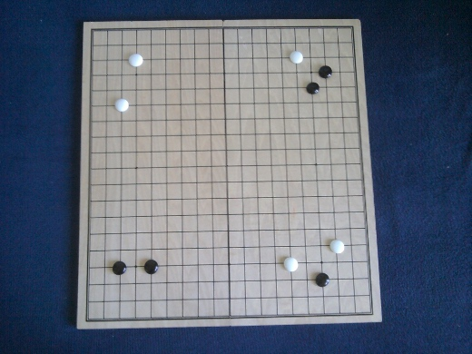

# Imago Go Image Recognition

멀티미디어 시스템 2019년도 1학기 바둑 이미지 detection을 위한 레파지토립니다. 원본 오픈소스는 [tomasmcz/imago](https://github.com/tomasmcz/imago)이며, 해당 라이센스를 따릅니다.


## 도커로 빠르게 시작하기

```shell
$ docker run -it nlkey2022/imago:0.1 /home/go_detection/image.jpg
```



```python
. . . . . . . . . . . . . . . . . . .
. . . . . . . . . . . . . . . . . . .
. . . W . . . . . . . . . . W . . . .
. . . . . . . . . . . . . . . . B . .
. . . . . . . . . . . . . . . B . . .
. . W . . . . . . . . . . . . . . . .
. . . . . . . . . . . . . . . . . . .
. . . . . . . . . . . . . . . . . . .
. . . . . . . . . . . . . . . . . . .
. . . . . . . . . . . . . . . . . . .
. . . . . . . . . . . . . . . . . . .
. . . . . . . . . . . . . . . . . . .
. . . . . . . . . . . . . . . . . . .
. . . . . . . . . . . . . . . . . . .
. . . . . . . . . . . . . . . . W . .
. . B . B . . . . . . . . W . . . . .
. . . . . . . . . . . . . . . B . . .
. . . . . . . . . . . . . . . . . . .
. . . . . . . . . . . . . . . . . . .
```


## 도커를 사용하지 않고 환경 구성

```shell
$ apt-get update
$ apt-get install -y python git make gcc build-essential python-dev python-pip
$ git clone https://github.com/AlphaKHU/go_detection && cd go_detection && make
$ pip install -r requirements.txt
```

- Inputs

```shell
$ python imago image.jpg
```
여러 이미지를 사용할 때는 다음과 같이 사용합니다.
```shell
$ python imago image1.jpg image2.jpg image3.jpg ....
```


- Output


```python
. . . . . . . . . . . . . . . . . . .
. . . . . . . . . . . . . . . . . . .
. . . W . . . . . . . . . . W . . . .
. . . . . . . . . . . . . . . . B . .
. . . . . . . . . . . . . . . B . . .
. . W . . . . . . . . . . . . . . . .
. . . . . . . . . . . . . . . . . . .
. . . . . . . . . . . . . . . . . . .
. . . . . . . . . . . . . . . . . . .
. . . . . . . . . . . . . . . . . . .
. . . . . . . . . . . . . . . . . . .
. . . . . . . . . . . . . . . . . . .
. . . . . . . . . . . . . . . . . . .
. . . . . . . . . . . . . . . . . . .
. . . . . . . . . . . . . . . . W . .
. . B . B . . . . . . . . W . . . . .
. . . . . . . . . . . . . . . B . . .
. . . . . . . . . . . . . . . . . . .
. . . . . . . . . . . . . . . . . . .
```


## Requirements

- Python 2.7 (including dev)
- PIL >= 3.0
- pygame
- matplotlib (for generating debug images)
- openCV (if you want to use a camera, otherwise not needed)
- for documentation:
    - sphinx
    - sphinx-argparse


## LICENSE

Copyright (c) 2014, Tomáš Musil

All rights reserved.
